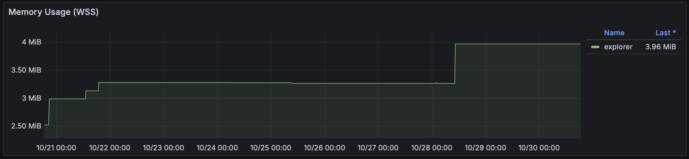
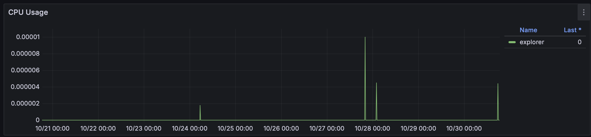
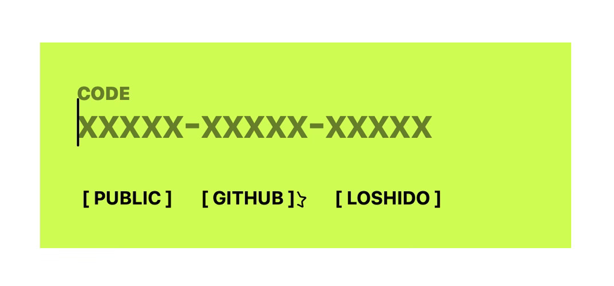
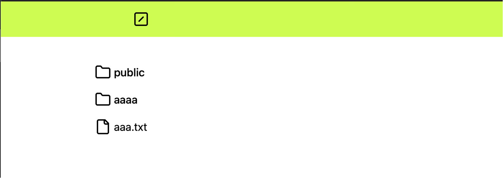
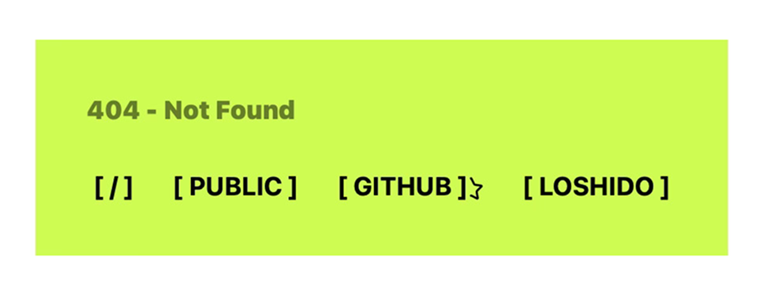

# A self hosted web server that imitates FTP

It allows you to access your files from your phone or any device anywhere.
Originally built to enhance the FTP experience & provide a lightweight software (14mb) to access a distant computer (my home server).

## Env variables

| Variable | Default | What? |
| --- | --- | --- |
| `ROCKET_ADDRESS` | `0.0.0.0` | interface binding |
| `ROCKET_PORT` | `80` | port binding |
| `JWT_SECRET` | ... | JWT signing secret |
| `AUTH_VERSION` | `1` | changing version allows to invalidate tokens |
| `PASS_FILE` | `./pass` | Where the password are located |
| `COOKIE_DOMAIN` | `localhost` | Domain of the app |
| `COOKIE_SECURE` | `no` | Whether the app is under TLS (yes/no) |
| `EXPLORER_DATA` | `./data` | Where is the data located |

>Be aware that in most use cases this app should be containerized, 
> and you may not need to change `EXPLORER_DATA` variable.

> Note that this app uses Rocket.rs (web framework for rust),
> the app inherit its environment variables

### PASS_FILE's file syntax

The file must follow this pattern

```
xxxxx-xxxxx-xxxxx
xxxxx-xxxxx-xxxxx
xxxxx-xxxxx-xxxxx
xxxxx-xxxxx-xxxxx
...
```
one key per line, 17 characters each including separators.

## Docker

`docker build -t explorer .`\
`docker run -d -p 80:80 -e JWT_SECRET=??? -v ./data/???:/app/data -v ./pass:/app/pass --name explorer ghcr.io/loshido/explorer:latest`

## In production



After 1 week of daily use, the pod's memory does not exceed 5mb and its CPU usage cannot be lower.

## Visuals



